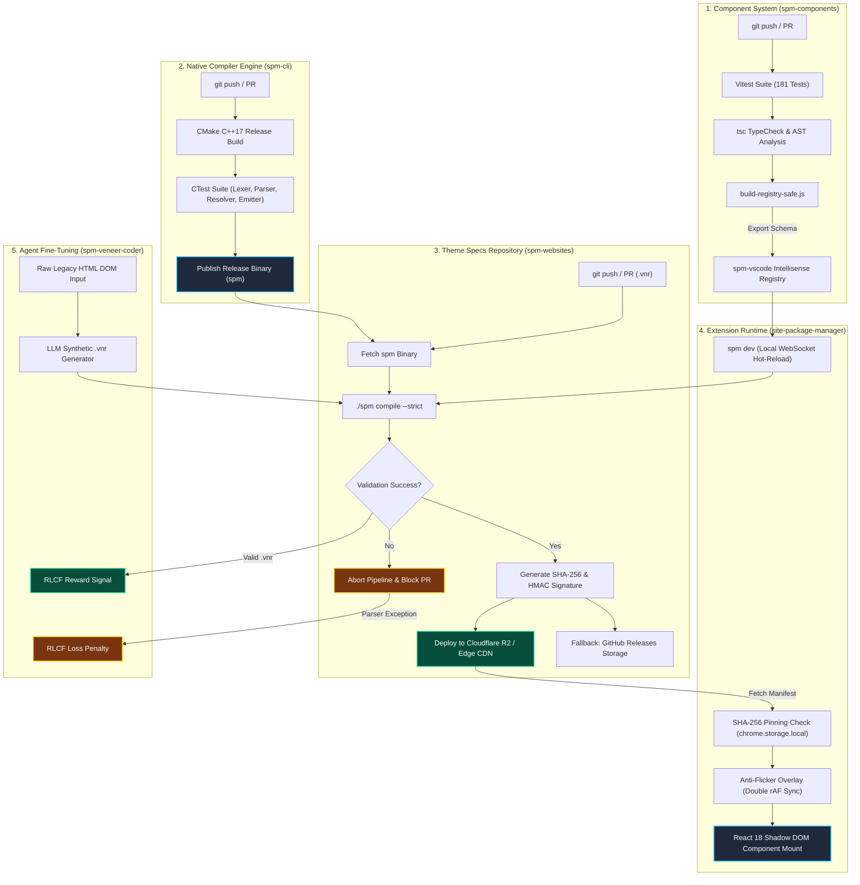

# Site Package Manager (SPM)

[](https://spm-ecosystem.github.io/spm-portal/)

Site Package Manager (SPM) is a high-performance, data-driven web modernization platform. It enables developers and AI agents to reconstruct legacy website interfaces using React 18 + Shadow DOM encapsulation—without modifying the target site's original server or codebase.

---

## 🌐 The SPM Repository Ecosystem

The SPM platform is composed of 5 decoupled, specialized repositories:

| Repository | Purpose | Primary Tech | Links |
| :--- | :--- | :--- | :--- |
| **`site-package-manager`** *(This repo)* | The core extension engine that loads JSON manifests, intercepts page loads, verifies integrity, and mounts Shadow DOM components. | TypeScript, React 18, Vite | [GitHub Repository](https://github.com/spm-ecosystem/site-package-manager) |
| **`spm-cli`** | C++17 native compiler and watcher. Compiles Veneer DSL (`.vnr`) files into validated JSON manifests and hosts WebSocket hot-reload servers. | C++17, CMake, WebSockets | [GitHub Repository](https://github.com/spm-ecosystem/spm-cli) |
| **`spm-vscode`** | VS Code extension providing real-time syntax coloring, autocompletion, and JSON schema intellisense for Veneer `.vnr` layouts. | TypeScript, VS Code API | [GitHub Repository](https://github.com/spm-ecosystem/spm-vscode) |
| **`spm-websites`** | GitOps theme registry hosting compiled layouts, CSS variables, and Veneer spec designs for target websites (e.g. Hacker News dark-modern). | Veneer Spec, CSS | [GitHub Repository](https://github.com/spm-ecosystem/spm-websites) |
| **`spm-components`** | Reusable UI design system (16 Primitives + 13 Dedicated Views) injected into legacy pages. | React 18, DOMPurify, CSS | [GitHub Repository](https://github.com/spm-ecosystem/spm-components) |
| **`spm-qa-test-suite`** | Comprehensive QA test suite with 181 automated tests, Playwright E2E flows, and `spm-veneer-coder` AI agent specs. | Vitest, Playwright | [GitHub Repository](https://github.com/spm-ecosystem/spm-qa-test-suite) |

---

## 🔄 Automated CI/CD & Inter-Repository Pipeline



---

## 🧩 Component System Overview (29 Agnostic Components)

The `spm-components` library provides **29 agnostic React components** split into two structural tiers:

### 1. Primitive Components (16 Atomic Blocks)
- **Layout & Structure**: `UiBox`, `UiFlexRow`, `UiFlexColumn`, `UiGrid`, `UiScrollBox`
- **Media & Display**: `UiImage`, `UiImageCard`, `UiImageViewer` (interactive zoom/fit controls)
- **UI Controls & Indicators**: `UiTagBadge`, `UiTabs`, `UiPaginationBar`, `UiSearchBar`, `UiLink`, `UiText`, `UiToast`, `UiTable`

### 2. Dedicated Page Views (13 High-Level Page Constructs)
- `UiTableListPage`: Complete list/table view with sortable columns and pagination.
- `UiCommentListPage`: Responsive comment tree thread with DOMPurify XSS sanitization.
- `UiFormContainer`: Authentication and input form container with tabbed mode toggling (`[ Login ] [ Register ]`), hidden fields, and recovery links.
- `UiModernGridPage`: Full gallery grid page with responsive tag sidebar and search filtering.
- `UiNavHeader`: Sticky glassmorphic navbar with logo, centered links, and pipe separator stripping.
- `UiPostDetails`: Rich post detail view with metadata and tag groups.
- `UiScrollPanel`: Slide-over lateral panel for contextual data.
- `UiSplitLayout`: Dual-pane preview/details split view.
- `UiTerminalConsole`: Dark interactive terminal log console.
- `UiNestedTreeTable`: Hierarchical tree table view.
- `UiDashboardPage`: Responsive multi-card dashboard view.
- `UiStatsDashboard`: Metrics and analytics dashboard view.
- `UiHeroLanding`: Hero section landing view with CTA and search bar.

---

## 🤖 AI Agent Fine-Tuning Pipeline (`spm-veneer-coder`)

The `spm-veneer-coder` pipeline trains specialized LLMs to read raw legacy HTML DOMs and emit valid, compilable Veneer DSL (`.vnr`) specifications:

- **HTML ➔ VNR Dataset**: Curated training pairs mapping raw legacy HTML structures to production-grade Veneer DSL specs.
- **Compiler-Guided Fine-Tuning (RLCF)**: Reinforcement Learning with Compiler Feedback. Every LLM-generated `.vnr` is compiled via `spm-cli --strict`. Parse errors or invalid component props trigger instant loss penalties, guaranteeing zero-hallucination output.

---

## ⚡ Core Engine Features

1. **Zero-Flickering System (Double rAF Sync)**: Injects anti-flicker CSS at `document_start` and uses double `requestAnimationFrame` synchronization to reveal the page only after React 18 DOM paint completes.
2. **SHA-256 Integrity Pinning**: Persists manifest SHA-256 signatures in `chrome.storage.local` to verify authenticity and prevent client-side tampering.
3. **Resilient JSON Prop Parsing**: `sanitizeComponentProps` with `tryParseRelaxedJson` converts unquoted JSON strings and serialized arrays into native JavaScript objects gracefully.
4. **WebSocket Hot-Reload (`spm dev`)**: Recompiles `.vnr` files on-the-fly and pushes updates into Chrome Shadow DOM in milliseconds without page refresh.

---

## 📖 Documentation Portal

*   🌐 [**Interactive SPM Documentation Portal**](https://spm-ecosystem.github.io/spm-portal/)
*   📖 [**Layout Manifest Schema Reference**](https://github.com/spm-ecosystem/spm-cli/blob/main/docs/manifest_schema.md)
*   💻 [**Veneer Spec Language Reference**](https://github.com/spm-ecosystem/spm-cli/blob/main/docs/veneer_spec.md)
*   🎨 [**Component Development & API Reference**](https://github.com/spm-ecosystem/spm-components/blob/main/docs/components.md)
*   🧭 [**Contribution Guide**](./docs/contribution_guide.md)

---

## ⚡ Quick Start

```bash
# Install dependencies
npm install

# Build component registry & extension bundle
npm run build

# Run Vitest test suites (181 tests)
npm run test
```

### Load Extension in Chrome
1. Open `chrome://extensions` and enable **Developer Mode**.
2. Click **Load unpacked** and select the `dist/` directory.

---

## 📄 License

Licensed under the [MIT License](./LICENSE).
