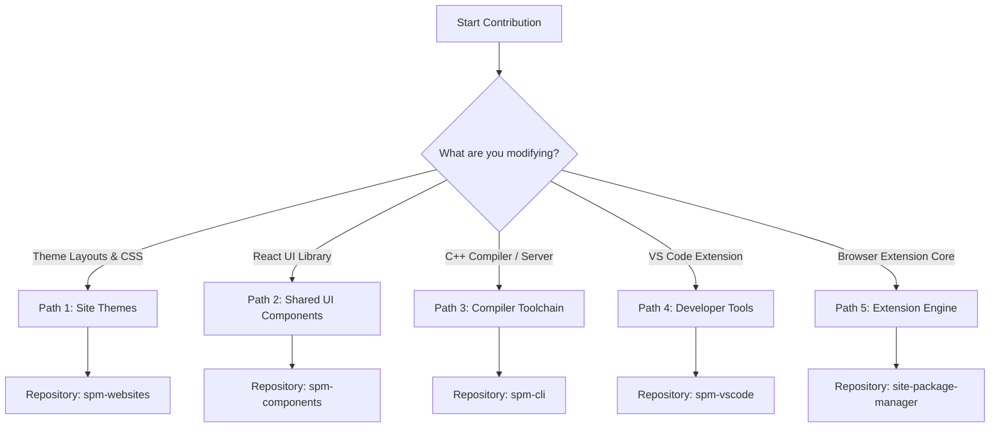

# Site Package Manager (SPM) - Contribution Guide

Thank you for contributing to the Site Package Manager (SPM) project! SPM is a modular web modernization ecosystem. To keep the project clean, fast, and structured, contributions are divided into distinct paths depending on what repository you are editing.

---

## Contribution Pathways



---

## 🧭 Path 1: Contributing to Site Themes & Layouts
If you are adding a theme for a new website or updating layouts for an existing site:

1.  **Repository**: [**`spm-websites`**](file:///home/watashi/Projects/spm-websites/README.md)
2.  **Workflow**:
    *   Navigate to your target site directory (e.g. `safebooru.org/`).
    *   Modify or write modular `.vnr` design templates inside the `vnr_project/` directory.
    *   Ensure all selectors and domain patterns are **generic and agnostic** in documentation examples.
3.  **Local Testing (Hot-Reload)**:
    *   Launch the local dev watcher from the CLI tool:
        ```bash
        spm dev /path/to/theme/project/
        ```
    *   Activate **Developer Mode** in the Chrome extension popup and load the theme to watch styles refresh instantly when you save.
4.  **Compilation**:
    *   Before pushing, compile the final layout manifest:
        ```bash
        spm compile vnr_project/ -o manifest.json
        ```
    *   Verify the compiled `manifest.json` conforms to the standard [**Theme Manifest Schema**](file:///home/watashi/Projects/extension/docs/manifest_schema.md).

---

## 🎨 Path 2: Contributing to Shared UI Components
If you want to add a new reusable design block or fix a bug in a layout primitive:

1.  **Repository**: [**`spm-components`**](file:///home/watashi/Projects/spm-components/README.md) (linked as a submodule inside `src/components/` in the main extension repository).
2.  **Prerequisites**: React 18, vanilla CSS variables.
3.  **Coding Rules**:
    *   **Named Exports Only**: Always export components as named functions (e.g., `export function UiMyCard() {}`).
    *   **Strict Variable Scoping**: Never write hardcoded colors. Use SPM design tokens (e.g., `var(--spm-bg-primary)`).
    *   **Props Contract**: Spread `className` and `style` props onto root nodes to allow positioning overrides at layout mount.
4.  **Auto-Registration**:
    *   After adding a component file, run the registry generator script in the extension root to compile props contracts:
        ```bash
        npm run build-registry
        ```
    *   Refer to the [**Component Development Guide**](file:///home/watashi/Projects/extension/docs/components.md) for step-by-step templates.

---

## ⚙️ Path 3: Contributing to the Compiler Toolchain
If you want to enhance the C++ parser, fix resolver bugs, or update the WebSocket dev server:

1.  **Repository**: [**`spm-cli`**](file:///home/watashi/Projects/spm-cli/README.md)
2.  **Prerequisites**: C++17 compatible compiler, CMake 3.12+, Make.
3.  **Workflow**:
    *   Modify lexer, parser, resolver, or emitter header files under `src/veneer/`.
    *   Rebuild and execute integration tests to prevent regression:
        ```bash
        cmake .
        make
        ./test_emitter
        ```
    *   Verify the CLI resolves and compiles sibling class hierarchies properly.

---

## 🔌 Path 4: Contributing to VS Code Developer Tools
If you want to update the editor syntax highlighter or background linter helper:

1.  **Repository**: [**`spm-vscode`**](file:///home/watashi/Projects/vscode-theme-manifest-intellisense/README.md)
2.  **Workflow**:
    *   Clone the extension source and link it to your local editor extensions folder.
    *   Update TextMate grammar configurations for `.vnr` scopes.
    *   If TS registry props contracts change, rebuild the JSON validation schema:
        ```bash
        npm run build-registry
        ```

---

## 📦 Path 5: Contributing to the Browser Extension Core
If you want to modify the runtime loader, the Shadow DOM injector, or the popups:

1.  **Repository**: [**`site-package-manager`**](file:///home/watashi/Projects/extension/README.md) (This repository)
2.  **Architecture Guidelines**:
    *   **Anti-Flickering System**: Ensure updates do not bypass the body visibility opacity control (`revealPage()`).
    *   **Performance**: Keep the content script parser light; avoid parsing overhead or DOM traversals inside recursive loops.
    *   **TypeScript**: Strictly avoid implicit `any` and unused variables.
3.  **Validation**:
    *   Run test suites before committing:
        ```bash
        npm test
        ```

---

## 📝 General Project Standards

Regardless of the repository you contribute to, you must follow these standards:
- **Language**: English only for code comments, logs, documentation, and commit messages.
- **Commits**: Conventional Commits style (e.g. `feat:`, `fix:`, `docs:`, `refactor:`, `chore:`).
- **Licensing**: All components and subprojects are licensed under the MIT License. A matching [`LICENSE`](file:///home/watashi/Projects/extension/LICENSE) file must reside in the root of each repository.
